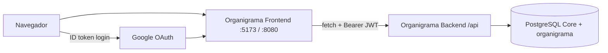
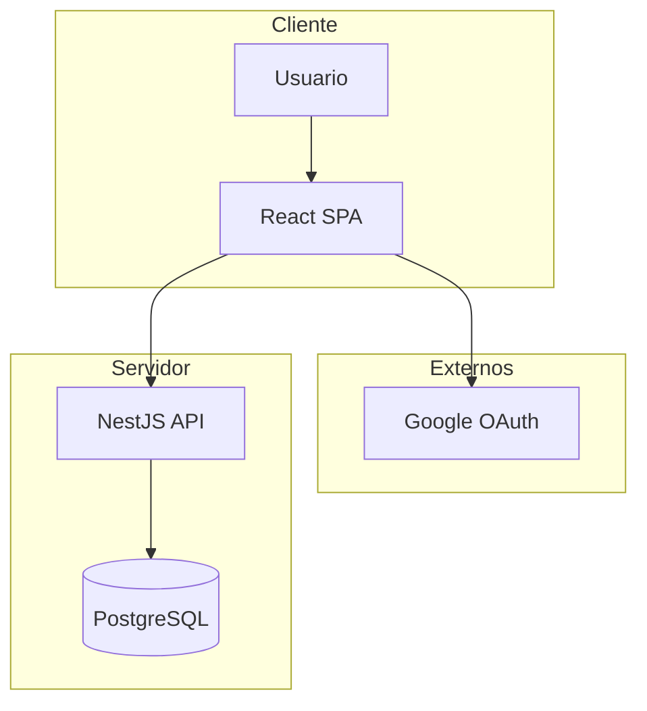
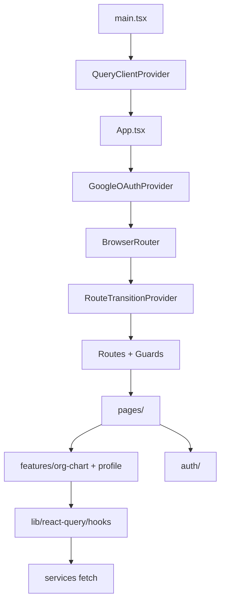
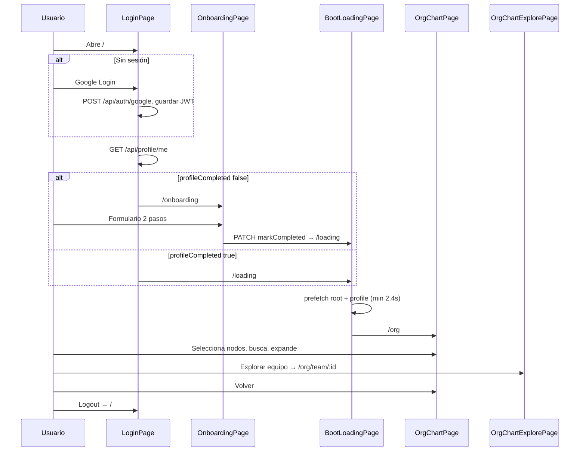
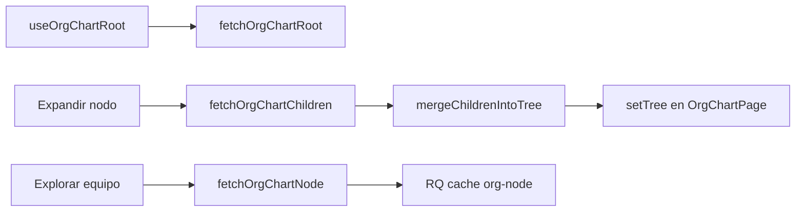

# Organigrama OP Frontend

Documentación técnica y funcional del cliente web que visualiza el organigrama de la **Dirección de Operaciones (CUN)**. SPA en **React 19 + Vite 8**, autenticación Google, carga progresiva del árbol y experiencia visual tipo **radar / cabina submarina**.

**Documentación relacionada:**

| Documento | Audiencia |
|-----------|-----------|
| [../docs/FLUJO-USUARIO.md](../docs/FLUJO-USUARIO.md) | Flujo técnico usuario + componentes |
| [../docs/GUIA-TUTORIAL-FLUJO.md](../docs/GUIA-TUTORIAL-FLUJO.md) | Tutorial no técnico |
| [../docs/RESUMEN-FLUJO-USUARIO.md](../docs/RESUMEN-FLUJO-USUARIO.md) | Resumen de una página |
| [../Organigrama_Backend/README.md](../Organigrama_Backend/README.md) | API, dominio, visibilidad |
| [src/lib/react-query/README.md](./src/lib/react-query/README.md) | Convenciones React Query internas |
| [docs/SMOKE_TEST_NAVEGADOR.md](./docs/SMOKE_TEST_NAVEGADOR.md) | Smoke E2E en navegador |

---

## Resumen ejecutivo

### Qué es Organigrama OP

Aplicación web de **solo consulta** para explorar la jerarquía organizacional de Dirección de Operaciones: mapa interactivo, búsqueda de colaboradores, fichas de persona y exploración de equipos por niveles.

### Qué problema resuelve

- Hacer legible una estructura grande sin cargar todo el árbol de una vez.
- Ofrecer un punto único de consulta (cargo, área, contacto según permisos) para colaboradores institucionales.
- Completar datos de onboarding (contacto y emergencia) en el primer acceso.

### Usuarios objetivo

Colaboradores activos de la CUN con cuenta **@cun.edu.co** registrados en Core y convención de correo institucional válida para login.

### Qué puede hacer un usuario

| Acción | Descripción |
|--------|-------------|
| Iniciar sesión | Google OAuth (dominio institucional) |
| Completar perfil | Primera vez: documento, teléfono, contacto de emergencia |
| Ver organigrama global | Mapa desde la raíz institucional |
| Expandir nodos | Carga lazy de hijos directos |
| Buscar personas | Panel superior con autocompletado |
| Ver ficha y resumen | Paneles laterales al seleccionar |
| Explorar equipo | Vista centrada en un líder y su equipo |
| Cerrar sesión | Limpia sesión local y caché |

### Responsabilidades del frontend

- UI, navegación, guardas de ruta, persistencia de sesión en el navegador.
- Orquestación de llamadas al API (`fetch` + React Query).
- Fusión del árbol en memoria (`mergeChildrenIntoTree`).
- Mapa visual (React Flow / XYFlow), temas por nivel, animaciones radar.
- Redirección según `profileCompleted`.

### Responsabilidades del backend

- Autenticación JWT, reglas de visibilidad, construcción de nodos desde PostgreSQL.
- Endpoints `/api/org-chart/*`, `/api/profile/*`, `/api/auth/*`.

### Comunicación entre sistemas



- Base URL: `import.meta.env.VITE_API_BASE_URL` (default `http://localhost:3000`).
- JSON con `Authorization: Bearer` en casi todas las peticiones.
- Fotos: URLs del API con `?access_token=` para etiquetas ``.

---

## Visión general del producto (usuario final)

1. **Pantalla de ingreso** — Estética marina; botón Google.
2. **Onboarding** (solo primera vez) — Dos pasos de datos personales.
3. **Preparando organigrama** — Pantalla de espera mientras precarga datos.
4. **Centro de mando** — Mapa con nodos “holográficos”, radar de fondo, líneas de dependencia.
5. **Exploración** — Clic en persona → ficha; “Explorar equipo” → nueva vista; buscador para saltar a alguien.

La narrativa visual evoca **sonar / radar / submarino**: fondos oscuros cyan–teal, anillos giratorios, HUD en tarjetas de nodo.

---

## Arquitectura general



| Capa | Tecnología |
|------|------------|
| Navegador | Chrome/Edge/Firefox modernos |
| UI | React 19, TypeScript 6 |
| Build | Vite 8 |
| Routing | React Router 7 |
| Mapa | @xyflow/react 12 |
| Datos remotos | TanStack React Query 5 |
| Estilos | Tailwind CSS 4 + `index.css` (~1800 líneas custom) |
| Auth UI | @react-oauth/google |
| Producción estática | `serve` en puerto 8080 |

**No presentes en el código:** Axios, Redux, Zustand (uso directo), Framer Motion.

---

## Arquitectura frontend



| Pieza | Rol |
|-------|-----|
| **pages/** | Pantallas por ruta (`LoginPage`, `OrgChartPage`, …) |
| **features/** | Dominio: organigrama y perfil |
| **auth/** | Token, guardas, logout, URLs de foto |
| **contexts/** | Overlay de transición entre rutas |
| **lib/react-query/** | Caché servidor, hooks, prefetch |
| **components/** | UI compartida (`PageLoadingScreen`) |

No hay carpeta `layouts/` dedicada: el shell visual está en `App.tsx` (gradientes globales).

---

## Tecnologías utilizadas

### React

**Qué es:** Biblioteca UI por componentes.  
**Uso:** Toda la aplicación; React 19 con `StrictMode` en `main.tsx`.  
**Dónde:** `src/**/*.tsx`.

### TypeScript

**Qué es:** Tipado estático sobre JavaScript.  
**Uso:** Proyecto 100 % `.ts`/`.tsx`; build con `tsc -b` antes de Vite.  
**Dónde:** `tsconfig.json`, `tsconfig.app.json`, `tsconfig.node.json`.

### Vite

**Qué es:** Bundler y dev server.  
**Uso:** `npm run dev` (puerto **5173**), `npm run build` → `dist/`.  
**Dónde:** `vite.config.ts` — plugins `@vitejs/plugin-react`, `@tailwindcss/vite`.

### Tailwind CSS v4

**Qué es:** Utilidades CSS.  
**Uso:** Layout, tipografía, responsive; import `@import 'tailwindcss'` en `index.css`.  
**Dónde:** Clases en páginas/componentes; no hay `tailwind.config.js` separado (config vía Vite plugin).

### React Router

**Qué es:** Enrutamiento SPA.  
**Uso:** `BrowserRouter`, `Routes`, `Route`, `Navigate`, `useNavigate`, `useParams`.  
**Dónde:** `App.tsx`, páginas.

### TanStack React Query

**Qué es:** Caché y sincronización de estado servidor.  
**Uso:** Perfil, organigrama, búsqueda, mutaciones de perfil; prefetch en boot y expansión.  
**Dónde:** `lib/react-query/`, hooks en páginas y paneles.

### @xyflow/react (React Flow)

**Qué es:** Librería de grafos/nodos para React.  
**Uso:** Canvas del organigrama (`OrgMapView`), pan/zoom, edges, nodo custom `OrgMapNode`.  
**Dónde:** `OrgMapView.tsx`, estilos `@xyflow/react/dist/style.css`.

### @react-oauth/google

**Qué es:** Botón y flujo OAuth Google en el cliente.  
**Uso:** `GoogleOAuthProvider` + `GoogleLogin` en `LoginPage`.  
**Dónde:** `App.tsx`, `LoginPage.tsx`, `authService.getGoogleClientId()`.

### serve

**Qué es:** Servidor estático para SPA.  
**Uso:** `npm start` y CMD del Dockerfile (`-s dist` = fallback SPA).  
**Dónde:** Producción Cloud Run.

---

## Estructura de carpetas

```
Organigrama_Frontend/
├── public/                 # Estáticos (img/Submarino.png, etc.)
├── src/
│   ├── main.tsx
│   ├── App.tsx
│   ├── index.css
│   ├── assets/
│   ├── auth/
│   ├── components/
│   ├── contexts/
│   ├── features/
│   │   ├── org-chart/
│   │   │   ├── components/
│   │   │   ├── services/
│   │   │   ├── state/
│   │   │   ├── utils/
│   │   │   └── types.ts
│   │   └── profile/
│   ├── lib/react-query/
│   └── pages/
├── e2e/                    # Playwright smoke
├── docs/
├── Dockerfile
├── vite.config.ts
├── eslint.config.js
├── playwright.config.ts
└── package.json
```

| Carpeta | Responsabilidad |
|---------|-----------------|
| `pages/` | Una página por ruta principal |
| `features/org-chart/` | Mapa, paneles, servicio API organigrama, utilidades de árbol |
| `features/profile/` | Onboarding UI y servicio perfil |
| `auth/` | Sesión JWT y guardas de ruta |
| `lib/react-query/` | Infraestructura de datos remotos |
| `contexts/` | Loader global entre rutas |
| `e2e/` | Prueba smoke React Query |

---

## Flujo completo del usuario



| Paso | Pantalla | Persistencia |
|------|----------|--------------|
| 1 | `/` Login | — |
| 2 | Sesión | `sessionStorage` JWT + user |
| 3 | `/onboarding` opcional | PATCH perfil |
| 4 | `/loading` | React Query prefetch |
| 5 | `/org` | `orgChartMainSession` + RQ cache |
| 6 | `/org/team/:id` | RQ `org-node(id)` |
| 7 | Logout | `performAppLogout` limpia todo |

---

## Flujo de autenticación

```mermaid
flowchart TD
  A[Clic GoogleLogin] --> B[Credential idToken]
  B --> C[performAppLogout limpia previo]
  C --> D[POST /api/auth/google]
  D --> E[saveAuthSession]
  E --> F[fetchQuery profile]
  F --> G{profileCompleted?}
  G -->|no| H[/onboarding]
  G -->|sí| I[/loading]
```

| Elemento | Implementación |
|----------|----------------|
| **Login** | `LoginPage.handleGoogleSuccess` → `loginWithGoogleIdToken` |
| **Sesión** | `authStorage.ts` — `organigrama.accessToken`, `organigrama.authUser` |
| **JWT** | Enviado en header `Authorization`; no hay refresh token — re-login al expirar |
| **Guards** | `RequireAuth`, `RequireProfileComplete`, `RequireProfileIncomplete` |
| **Gate caché** | `profileGateStorage` — flag `profileCompleted` |
| **Fotos** | `photoUrl.withPhotoAccessToken` |
| **Logout** | `appLogout.performAppLogout` + `queryClient.clear()` |

**Sesión existente:** Si el usuario entra a `/` con token, `useEffect` en `LoginPage` consulta perfil y redirige sin mostrar botón.

**No hay** interceptor HTTP centralizado: cada `getJson` en servicios añade el Bearer manualmente.

---

## Flujo de onboarding

**Ruta:** `/onboarding`  
**Archivo:** `pages/OnboardingPage.tsx`  
**UI:** `features/profile/components/OnboardingUi.tsx`

| Paso UI | Campos obligatorios |
|---------|---------------------|
| 1 — Contacto | `document` (≥6 dígitos), `phone` |
| 2 — Emergencia | nombre, teléfono, parentesco |

| Aspecto | Detalle |
|---------|---------|
| Estado paso | `useOnboardingStatus` — `currentStep` en caché RQ (no en servidor) |
| Auto-foto | `POST /api/profile/me/photo-from-google` si hay foto Google y no hay en perfil |
| Envío | `usePatchProfile` con `markCompleted: true` → `/loading` |
| Validación | Cliente: `DOCUMENT_PATTERN`, campos requeridos; servidor valida completitud |

---

## Arquitectura de navegación

| Ruta | Página | Descripción |
|------|--------|-------------|
| `/` | `LoginPage` | Ingreso Google |
| `/onboarding` | `OnboardingPage` | Perfil incompleto |
| `/loading` | `BootLoadingPage` | Precarga + transición |
| `/org` | `OrgChartPage` | Organigrama principal |
| `/org/team/:personId` | `OrgChartExplorePage` | Equipo bajo una persona |
| `/org-chart/team/:personId` | `OrgChartExplorePage` | Alias legacy |
| `/org-chart` | — | Redirect → `/org` |
| `*` | — | Redirect → `/` |

**Nota:** `OrgChartPage.handleExploreTeam` navega a `/org-chart/team/:id`; la ruta canónica nueva es `/org/team/:id`. Ambas montan la misma página.

---

## Páginas del sistema

### LoginPage

| Campo | Valor |
|-------|-------|
| **Ruta** | `/` |
| **Archivo** | `src/pages/LoginPage.tsx` |
| **Objetivo** | Autenticación Google |
| **Componentes** | `GoogleLogin`, SVG decorativo, imagen submarino (`/img/Submarino.png`) |
| **Servicios** | `loginWithGoogleIdToken`, `fetchProfileMe` |
| **Estado** | `loading`, `error`, ancho botón responsive |
| **Flujo** | Login → perfil → `/onboarding` o `/loading` |

### OnboardingPage

| Campo | Valor |
|-------|-------|
| **Ruta** | `/onboarding` |
| **Archivo** | `src/pages/OnboardingPage.tsx` |
| **Componentes** | `OnboardingUi.*` |
| **Hooks** | `useOnboardingStatus`, `usePatchProfile`, `usePostPhotoFromGoogle` |
| **Servicios** | `patchProfileMe`, `postPhotoFromGoogle` |

### BootLoadingPage

| Campo | Valor |
|-------|-------|
| **Ruta** | `/loading` |
| **Archivo** | `src/pages/BootLoadingPage.tsx` |
| **Componentes** | `PageLoadingScreen` |
| **Lógica** | `Promise.all` — min 2400 ms + prefetch `org-root` + `profile` → `navigate('/org')` |

### OrgChartPage

| Campo | Valor |
|-------|-------|
| **Ruta** | `/org` |
| **Archivo** | `src/pages/OrgChartPage.tsx` |
| **Componentes** | `OrgMapView`, `PersonDetailPanel`, `NodeSummaryPanel`, `OrgChartSearchPanel`, `LogoutButton` |
| **Hooks** | `useOrgChartRoot`, `useQueryClient` |
| **Estado local** | `tree`, `selectedPersonId`, `mapPersisted`, `conn`, `expandedNodeId` |
| **Sesión** | `orgChartMainSession` — restaura/guarda árbol y viewport |
| **MAP_MAX_LEVELS** | 3 |
| **Servicios** | `fetchOrgChartRoot`, children vía `orgChartChildrenQueryOptions`, `fetchHealth` |

### OrgChartExplorePage

| Campo | Valor |
|-------|-------|
| **Ruta** | `/org/team/:personId` |
| **Archivo** | `src/pages/OrgChartExplorePage.tsx` |
| **Cuerpo** | `OrgChartExploreBody` (keyed por `personId`) |
| **Variante** | Según `resolveTeamDisplayTier(tree)` — ver § Política de visualización por tamaño de equipo |
| **MAP_MAX_LEVELS** | 4 |
| **Hooks** | `useOrgChartNode(personId)` |
| **Navegación** | `showBackButton` → `/org`; explore anidado → `/org/team/:id` |

---

## Componentes principales

### OrgMapView

| Aspecto | Detalle |
|---------|---------|
| **Archivo** | `features/org-chart/components/OrgMapView.tsx` |
| **Responsabilidad** | Canvas React Flow, layout, expansión, cámara, persistencia viewport |
| **Props** | Ver tabla en § Arquitectura del organigrama |
| **Eventos** | `onSelectNode`, `onExploreTeam`, `onLoadChildren`, `onPersistedMapStateChange` |
| **Dependencias** | `buildOrgMap`, `buildVisibleSubtree`, `orgMapDisplayPolicy`, `truncateTreeToMaxLevels`, `OrgMapNode`, `RadarBackground` |
| **Estado interno** | Expansión hub, showRootChildren, camera intent, refs de nodos |

### OrgMapNode

| Aspecto | Detalle |
|---------|---------|
| **Archivo** | `features/org-chart/components/OrgMapNode.tsx` |
| **Responsabilidad** | Nodo custom React Flow — tarjeta holográfica, botones detalle/explorar/expandir |
| **Tema** | `orgMapLevelThemeToCssVars(resolveOrgMapTheme(level))` |
| **Hijos UI** | `OrgMapNodePhoto`, `OrgMapVacancyGlyph`, `OrgMapExpandedTeamPanel` |

### PersonDetailPanel

| Aspecto | Detalle |
|---------|---------|
| **Archivo** | `features/org-chart/components/PersonDetailPanel.tsx` |
| **Props** | `personId`, `treeDescendantCount`, `layoutVariant`, `onDetailPhotoUrl`, … |
| **Datos** | `useOrgPersonDetail(personId)` |
| **UX** | Overlay “ficha técnica”; respeta `canViewFullProfile` |

### NodeSummaryPanel

| Aspecto | Detalle |
|---------|---------|
| **Archivo** | `features/org-chart/components/NodeSummaryPanel.tsx` |
| **Datos** | `useOrgChartSummary(personId)` |
| **UI** | Panel colapsable de métricas jerárquicas |

### OrgChartSearchPanel

| Aspecto | Detalle |
|---------|---------|
| **Archivo** | `features/org-chart/components/OrgChartSearchPanel.tsx` |
| **Datos** | `useDebouncedValue` + `useOrgChartSearch` (mín. 2 caracteres) |
| **Evento** | `onSelectHit` → selección en página padre |

### TeamScrollListView

| Aspecto | Detalle |
|---------|---------|
| **Archivo** | `features/org-chart/components/TeamScrollListView.tsx` |
| **Responsabilidad** | Vista de página completa con scroll vertical para equipos >15 reportes directos |
| **Props** | `leader`, `members?`, `onSelectPerson`, `onExploreTeam?`, `showBackButton?`, `onBack?` |
| **UI** | Líder arriba (tokens de nivel) + lista de `OrgMapTeamMemberMiniCard` (`renderMode="teamListPage"`) |
| **Montaje** | `OrgChartExplorePage` cuando `resolveTeamDisplayTier(tree) === "teamListPage"` |

### OrgMapTeamMemberMiniCard / OrgMapExpandedTeamPanel

| Aspecto | Detalle |
|---------|---------|
| **Archivos** | `OrgMapTeamMemberMiniCard.tsx`, `OrgMapExpandedTeamPanel.tsx` |
| **Uso** | Tier `teamBox` (6–15) — grilla embebida en el nodo holo expandido |
| **Navegación** | **Ver equipo** delegada a `resolveTeamNavigation` (anti-anidación) |

### Componentes legacy (no montados en rutas)

| Componente | Archivo | Estado |
|------------|---------|--------|
| `OrgChartView` | `OrgChartView.tsx` | Árbol por tarjetas `OrgNodeCard`; **sin imports** |
| `DocTeamGridView` | `DocTeamGridView.tsx` | **Alias deprecated** de `TeamScrollListView` (reexport) |
| `GeneralAreasSummary` | `GeneralAreasSummary.tsx` | **sin imports** |
| `ProfileHud` | `ProfileHud.tsx` | **sin imports** |

---

## Arquitectura del organigrama

### Carga de datos



| Función | Archivo | Endpoint |
|---------|---------|----------|
| `fetchOrgChartRoot` | `orgChartService.ts` | `GET /api/org-chart/root` |
| `fetchOrgChartNode` | idem | `GET /api/org-chart/node/:id` |
| `fetchOrgChartChildren` | idem | `GET /api/org-chart/children/:id` |
| `mergeChildrenIntoTree` | `utils/mergeChildrenIntoTree.ts` | Fusiona hijos en árbol local |
| `findNodeInTree` | `utils/findNodeInTree.ts` | Búsqueda por id en árbol |
| `patchNodePhotoUrl` | `utils/patchNodePhotoUrl.ts` | Actualiza foto en árbol tras detalle |

### Cómo se dibuja el mapa

1. **Entrada:** `OrgNode` raíz (desde RQ o sesión).
2. **Truncado:** `truncateTreeToMaxLevels` según `maxRenderLevels` (3 en `/org`, 4 en explore).
3. **Subárbol visible:** `buildVisibleSubtree` según expansión local.
4. **Layout:** `buildOrgMap` en `orgMapLayout.ts` — posiciones x/y, edges, profundidad.
5. **React Flow:** nodos tipo `OrgMapNode`, edges con marcadores, `RadarBackground` detrás.
6. **Lazy:** `onLoadChildren` → API → `mergeChildrenIntoTree` → re-layout.

### Expansión de nodo

- Clic expandir en `OrgMapNode` → si `children` vacío, `onLoadChildren(parentId)`.
- Tras cargar, `onDirectChildrenVisible` → `prefetchDirectChildrenHints` (node + summary por hijo).
- Cámara: `OrgMapViewCamera` hace `fitView` con animación (~650 ms, respeta `prefers-reduced-motion`).

### Navegación a equipos

`onExploreTeam(id)` → guarda sesión mapa → prefetch `org-node` → `navigate(/org/team/:id)` (alias legacy: `/org-chart/team/:id`).

### Política de visualización por tamaño de equipo

**Archivo:** `features/org-chart/utils/orgMapDisplayPolicy.ts`

El frontend elige cómo mostrar los **reportes directos** de un nodo según su conteo (`direct_reports_count` del API, o `children.length` tras lazy load). No depende del rol docente.

| Hijos directos | Tier (`TeamDisplayTier`) | Vista / comportamiento |
|----------------|--------------------------|-------------------------|
| 1–5 | `treeMap` | Árbol/mapa normal — fila horizontal en React Flow (`buildVisibleSubtree`) |
| 6–15 | `teamBox` | Caja/equipo en grilla — `OrgMapExpandedTeamPanel` + `OrgMapTeamMemberMiniCard` dentro del nodo holo |
| 16+ | `teamListPage` | Lista con scroll — `TeamScrollListView` (explore) o botón **Ver equipo** → `/org/team/:id` (mapa principal) |

Constantes exportadas:

```typescript
export const TREE_MAX_CHILDREN = 5;
export const TEAM_BOX_MAX_CHILDREN = 15;

export type TeamDisplayTier = "treeMap" | "teamBox" | "teamListPage";
```

Helpers principales: `getDirectReportsCount`, `resolveTeamDisplayTier`, `isTreeTeam`, `isMediumTeam`, `isLargeTeam`, `shouldRenderHorizontalRow`, `shouldRenderTeamBox`, `shouldNavigateToTeamListPage`, `resolveTeamNavigation`.

#### Regla anti-anidación

Dentro de un contexto `teamBox` o `teamListPage`, el botón **Ver equipo** de cualquier mini-card **siempre navega** a `/org/team/:id`. No se abre otra caja ni otra lista inline en el mismo lienzo.

`resolveTeamNavigation(node, currentMode)` devuelve `navigateToTeamPage` cuando:

- `currentMode` es `teamBox` o `teamListPage`, o
- el hijo tiene tier `teamListPage` (>15 reportes), o
- el nodo tiene `deferred_team` (límite de profundidad del mapa).

#### Dónde se aplica cada tier

| Contexto | 1–5 | 6–15 | 16+ |
|----------|-----|------|-----|
| `/org` — expandir raíz o fila 2 | Fila horizontal | Hub embebido | CTA **Ver equipo** → explore |
| `/org/team/:id` (`OrgChartExplorePage`) | `OrgMapView` | `OrgMapView` + hub | `TeamScrollListView` |

`OrgChartExplorePage` decide la vista con:

```typescript
const tier = resolveTeamDisplayTier(tree);
if (tier === "teamListPage") return <TeamScrollListView ... />;
return <OrgMapView initialShowRootChildren ... />;
```

#### Colores, lazy loading y permisos

- **Colores por nivel:** todas las vistas usan `resolveOrgMapTheme`, `visualLevel` y `data-visual-level` (L1–L5; docentes resueltos como L5 en `orgMapLevelTheme.ts`). `TeamScrollListView` reutiliza `OrgMapTeamMemberMiniCard` tematizada — no estilo cyan fijo.
- **Lazy loading:** sin cambios — `onLoadChildren` / `fetchOrgChartChildren` antes de pintar hub o lista; explore precarga hijos si `teamListPage` y `children` vacío.
- **`canViewFullProfile`:** sin cambios — la ficha (`PersonDetailPanel`) sigue respetando visibilidad jerárquica del backend; esta política solo afecta layout del organigrama.

---

## Sistema visual del organigrama

### Niveles jerárquicos (color)

**Archivo:** `features/org-chart/utils/orgMapLevelTheme.ts`

| Nivel | Familia cromática (aprox.) |
|-------|----------------------------|
| L1 | Cyan |
| L2 | Verde |
| L3 | Dorado |
| L4 | Púrpura |
| L5 | Naranja |
| Vacante | Slate (`ORG_MAP_VACANCY_THEME`) |

Tokens exportados a CSS variables `--org-lvl-*` en `.org-map-holo`.

### Radar y fondo

| Elemento | Ubicación |
|----------|-----------|
| Anillos + barrido | `RadarBackground.tsx` + `.radar-background*` en `index.css` |
| Líneas guía | `.radar-guide-line*` |
| Animación sweep | `@keyframes radar-sweep-rotate` |
| Grid atmósfera | `.org-map-shell__atmosphere` |

### Nodos y conectores

| Elemento | Ubicación |
|----------|-----------|
| Tarjeta holográfica | `.org-map-holo*` en `index.css` |
| React Flow edges | Config en `OrgMapView` — `MarkerType` |
| Vacante | `OrgMapVacancyGlyph` |
| Hub equipo interno | `OrgMapExpandedTeamPanel` + mini cards |
| Lista equipos grandes | `TeamScrollListView.tsx` (>15 reportes en explore) |

### Shell global App

Gradientes fijos en `App.tsx`: `bg-[#020617]`, radiales cyan/teal, viñeta oscura en bordes.

### Login / onboarding

Clases `.login-sub*`, `.onboarding-sub__bg` — misma línea visual marina.

### Regla crítica React Flow

`index.css` documenta: **no transformar** `.react-flow__viewport` con CSS custom — rompe pan/zoom. El efecto 3D/HUD está en el nodo, no rotando el canvas.

---

## Sistema de diseño

### Paleta (observada en código)

| Uso | Valor típico |
|-----|--------------|
| Fondo app | `#020617`, `#06111f` |
| Acento primario | cyan `rgba(14,165,233,…)`, teal `rgba(20,184,166,…)` |
| Texto | `text-slate-100`, `slate-200` |
| Éxito conexión | emerald en pill “Conectado” |
| Error | `rose-300` en mensajes |

### Tipografía

Sistema por defecto del navegador + Tailwind (`text-sm`, `text-[11px]` en pills de estado).

### Narrativa visual

| Metáfora | Manifestación |
|----------|----------------|
| **Radar** | Anillos, barrido rotatorio, líneas cruzadas |
| **Submarino / cabina** | Login con imagen submarino, fondos marinos |
| **Centro de mando** | Mapa central, paneles HUD, scan lines en ficha |
| **Exploración** | Zoom `fitView`, botón “Explorar equipo”, drill-down de rutas |

No hay `theme.ts` centralizado: tokens de nivel en `orgMapLevelTheme.ts`; resto en Tailwind arbitrario + CSS.

---

## Gestión de estado

| Mecanismo | Qué administra |
|-----------|----------------|
| **React Query** | Datos API: root, node, children, person, summary, search, profile, onboarding-status |
| **useState (páginas)** | Selección, árbol fusionado, UI panels, conexión API |
| **sessionStorage** | JWT, usuario, profile gate, org chart main session |
| **RouteTransitionContext** | Overlay global de carga entre rutas |
| **Context API** | Solo `RouteTransitionProvider` (no AuthContext) |

**No hay:** Redux, Zustand directo, MobX.

### React Query — defaults

```typescript
staleTime: 5 min
gcTime: 30 min
refetchOnWindowFocus: false
retry: 1
```

Claves en `lib/react-query/queryKeys.ts`.

---

## Comunicación con backend

### Cliente HTTP

**`fetch` nativo** — función interna `getJson<T>` en:

- `features/org-chart/services/orgChartService.ts`
- `features/profile/services/profileService.ts`
- `auth/authService.ts`

Patrón:

```typescript
const res = await fetch(`${BASE_URL}${path}`, {
  headers: {
    Accept: 'application/json',
    ...(token ? { Authorization: `Bearer ${token}` } : {}),
  },
})
```

**No hay:** Axios, interceptores globales, retries automáticos más allá de RQ `retry: 1`.

### Tabla de servicios

| Archivo | Funciones | Endpoints |
|---------|-----------|-----------|
| `orgChartService.ts` | `fetchOrgChartRoot`, `fetchOrgChartNode`, `fetchOrgChartChildren`, `fetchOrgChartSearch`, `fetchOrgPersonDetail`, `fetchOrgSummary`, `fetchHealth`, deprecated `fetchOrgChart`, `fetchOrgChartSubtree`, `fetchGeneralAreasSummary` | `/api/org-chart/*`, `/api/health` |
| `profileService.ts` | `fetchProfileMe`, `patchProfileMe`, `postPhotoFromGoogle` | `/api/profile/me` |
| `authService.ts` | `loginWithGoogleIdToken`, `fetchCurrentUser` | `/api/auth/google`, `/api/auth/me` |

### Manejo de errores HTTP

`getJson` lanza `Error` con texto `HTTP {status} en {path}`. Componentes muestran mensajes en UI (`chartError`, `profileError`) o redirección en guards.

---

## Modelos y tipos

**Archivo principal:** `features/org-chart/types.ts`

| Tipo | Propósito |
|------|-----------|
| `OrgNode` | Nodo del árbol (id, name, role, children, direct_reports_count, photoUrl, nodeKind, …) |
| `OrgChartSearchHit` | Resultado de búsqueda con path jerárquico |
| `OrgPersonDetail` | Ficha con `canViewFullProfile` y `profile` opcional |
| `OrgSummaryResponse` | Resumen de conteos por nodo |
| `OrgNodeKind` | `'person' \| 'vacancy'` |

**Perfil:** `features/profile/types.ts` — `ProfileMeResponse`, etc.

**Auth:** `auth/types.ts` — `AuthUser`, `GoogleLoginResult`.

Helpers: `countPeopleUnder`, `orgPersonDisplayName`, `isOrgNodeVacancy`, …

---

## Variables de entorno

Solo variables `VITE_*` se exponen al bundle (build-time).

| Variable | Obligatoria | Descripción | Ejemplo |
|----------|-------------|-------------|---------|
| `VITE_API_BASE_URL` | Recomendada | URL base del API sin slash final | `http://localhost:3000` |
| `VITE_GOOGLE_CLIENT_ID` | Sí (login) | OAuth 2.0 Web client ID | `xxx.apps.googleusercontent.com` |

**Archivo plantilla:** `.env.example`

**Producción Docker:** `ARG`/`ENV` en Dockerfile con defaults a Cloud Run backend documentado.

**E2E:** `SMOKE_FRONTEND_URL` (Playwright, no VITE).

No incluir secretos JWT en el frontend — el token se obtiene post-login del API.

---

## Configuración local

### Requisitos

- Node.js LTS (22 en Docker)
- npm
- Backend Organigrama en ejecución
- Proyecto Google Cloud OAuth con `http://localhost:5173` en orígenes autorizados

### Instalación

```bash
cd Organigrama_Frontend
cp .env.example .env.local   # o .env según convención del equipo
npm install
```

---

## Ejecución en desarrollo

```bash
npm run dev
```

**Internamente:** Vite levanta servidor en **5173**, HMR, compila TS on-the-fly, aplica plugin React y Tailwind v4.

Abrir `http://localhost:5173`. El API por defecto apunta a `http://localhost:3000`.

---

## Build de producción

```bash
npm run build
```

1. `tsc -b` — verificación de tipos.
2. `vite build` — bundle en `dist/` (assets hashed, tree-shaking).
3. Variables `VITE_*` **embebidas** en build — cambiar API URL requiere **rebuild**.

```bash
npm run preview   # sirve dist localmente (vite preview)
npm start         # serve -s dist -l tcp://0.0.0.0:${PORT:-8080}
```

---

## Docker

| Stage | Contenido |
|-------|-----------|
| **builder** | `npm ci`, copia fuentes, `ARG VITE_API_BASE_URL`, `VITE_GOOGLE_CLIENT_ID`, `npm run build` |
| **runner** | `serve -s dist` usuario `node`, puerto **8080** |

**SPA fallback:** flag `-s` de `serve` redirige rutas desconocidas a `index.html` (necesario para React Router).

**Build con API custom:**

```bash
docker build \
  --build-arg VITE_API_BASE_URL=https://TU-BACKEND.run.app \
  --build-arg VITE_GOOGLE_CLIENT_ID=TU_CLIENT_ID \
  -t organigrama-frontend .
```

---

## Cloud Run

Patrón observado en Dockerfile (valores por defecto en `ARG`):

| Tema | Detalle |
|------|---------|
| **Puerto** | 8080 (`PORT` inyectable) |
| **Imagen** | Node 22 Alpine + `serve` |
| **Build-time** | `VITE_*` — deben pasarse en `docker build`, no en runtime |
| **Runtime** | Solo archivos estáticos; no hay SSR |

**Pendiente en repo:** `cloudbuild.yaml`, URL frontend producción oficial, dominio OAuth producción.

Checklist DevOps: reconstruir imagen al cambiar backend URL o Google client; configurar CORS en backend con URL del frontend desplegado.

---

## Rendimiento

| Optimización | Beneficio |
|--------------|-----------|
| **Lazy children** | Solo pide hijos al expandir; payload pequeño |
| **React Query cache** | Evita refetch 5 min; prefetch de hijos visibles |
| **mergeChildrenIntoTree** | No re-descarga árbol completo |
| **orgChartMainSession** | Restaura viewport/expansión sin recomputar UX |
| **prefetchDirectChildrenHints** | Node + summary listos antes del clic |
| **keepPreviousData** | En `useOrgChartNode` — transición suave entre equipos |
| **Debounced search** | Reduce llamadas `/search` |
| **Camera reduced-motion** | `duration: 0` si usuario prefiere menos animación |
| **Batch en backend** | Conteos `direct_reports_count` sin N+1 (transparente al FE) |

**No implementado:** virtualización de nodos React Flow, `React.memo` sistemático, code-splitting por ruta (`React.lazy`).

---

## Manejo de errores

| Capa | Comportamiento |
|------|----------------|
| **Fetch** | Throw `Error` con status HTTP |
| **React Query** | `isError`, `error` en hooks; UI muestra mensaje |
| **Guards** | Redirect a `/` o `/onboarding` |
| **Login** | `setError` mensaje en pantalla |
| **Org chart** | `chartError` string en página |
| **Boot** | Catch en prefetch → igual navega a `/org` |

**No hay:** React Error Boundaries en el código actual.

---

## Scripts disponibles

| Script | Descripción |
|--------|-------------|
| `npm run dev` | Vite dev server :5173 |
| `npm run build` | `tsc -b && vite build` |
| `npm run preview` | Vista previa Vite de `dist/` |
| `npm start` | `serve -s dist` en `PORT` (default 8080) |
| `npm run lint` | ESLint en proyecto |
| `npm run smoke:e2e` | Playwright — `e2e/smoke-react-query.spec.ts` |

**No hay** script `test` unitario Vitest/Jest en `package.json`.

---

## Pruebas y QA

| Herramienta | Uso |
|-------------|-----|
| **Playwright** | Smoke E2E navegador |
| **Config** | `playwright.config.ts` — chromium, 120s timeout, 1 worker |
| **Env** | `SMOKE_FRONTEND_URL` (default `http://localhost:5173`) |
| **Resultados** | `e2e/smoke-results.json` |
| **Docs** | `docs/SMOKE_TEST_NAVEGADOR.md` |

```bash
# Terminal 1
npm run dev

# Terminal 2 (con backend y datos válidos)
npm run smoke:e2e
```

**Vitest/Jest:** no configurados en scripts del frontend.

---

## Guía para nuevo desarrollador

### 1. Levantar el proyecto

```bash
git clone <repo>
cd Organigrama_Frontend
cp .env.example .env.local
npm install
npm run dev
```

### 2. Conectar al backend

- Backend en `http://localhost:3000` o ajustar `VITE_API_BASE_URL`.
- Verificar pill “Conectado” en `/org` (`fetchHealth`).
- Mismo `VITE_GOOGLE_CLIENT_ID` que acepta el backend (`GOOGLE_CLIENT_ID`).

### 3. Entender la estructura

1. Rutas → `App.tsx`.
2. Pantalla principal → `OrgChartPage` + `OrgMapView`.
3. Datos → `orgChartService` + hooks en `lib/react-query/hooks`.
4. Tipos → `features/org-chart/types.ts`.

### 4. Agregar una página

1. Crear `src/pages/MiPage.tsx`.
2. Registrar `<Route path="/mi-ruta" element={...} />` en `App.tsx`.
3. Envolver con guardas si requiere auth: `<RequireAuth><RequireProfileComplete>…`.

### 5. Agregar una ruta protegida

Reutilizar patrón:

```tsx
<Route path="/nueva" element={
  <RequireAuth>
    <RequireProfileComplete>
      <NuevaPage />
    </RequireProfileComplete>
  </RequireAuth>
} />
```

### 6. Agregar un componente de feature

Ubicar en `features/org-chart/components/` o `features/profile/components/`. Importar desde la página, no desde `App.tsx` salvo providers.

### 7. Agregar un servicio API

1. Función `fetch` en `orgChartService.ts` o nuevo archivo en `features/.../services/`.
2. Hook en `lib/react-query/hooks/` + clave en `queryKeys.ts`.
3. Exportar desde `hooks/index.ts`.

### 8. Desplegar

1. `docker build` con `VITE_API_BASE_URL` y `VITE_GOOGLE_CLIENT_ID` de producción.
2. Push imagen → Cloud Run servicio frontend.
3. Registrar URL pública en OAuth Google y `CORS_ORIGIN` del backend.

---

## Convenciones del proyecto

| Tema | Convención |
|------|------------|
| **Componentes** | PascalCase; páginas en `pages/`, dominio en `features/` |
| **Hooks** | `use` prefix; React Query en `lib/react-query/hooks` |
| **Servicios** | Funciones `fetch*` async; sin clases |
| **Rutas** | Paths en inglés cortos: `/org`, `/loading` |
| **Estilos** | Tailwind para layout; clases semánticas largas en `index.css` para org-map |
| **Imports auth** | Relativos desde `../../../auth/` en features |
| **Tipos** | Co-locados en `types.ts` por feature |

---

## Troubleshooting

| Problema | Causa probable | Solución |
|----------|----------------|----------|
| CORS | Backend sin origen `http://localhost:5173` | `CORS_ORIGIN` en backend |
| 401 en organigrama | JWT ausente o expirado | Re-login |
| Google login falla | Client ID distinto FE/BE | Alinear `VITE_GOOGLE_CLIENT_ID` y backend |
| Pantalla blanca tras build | `VITE_API_BASE_URL` wrong en build | Rebuild Docker con ARG correcto |
| Mapa vacío | Backend sin raíz 1144 o sin auth | Verificar API con curl + token |
| Nodos no expanden | Error en `/children` | Network tab; revisar logs backend |
| Fotos rotas | URL sin token | `withPhotoAccessToken`; usuario logueado |
| Redirect loop | Perfil incompleto | Completar onboarding |
| React Flow pan roto | CSS en viewport | No añadir transform a `.react-flow__viewport` |
| Explore 404 | Persona inactiva | Validar id en Core |

---

## Roadmap técnico (inferido del código)

| Ítem | Evidencia |
|------|-----------|
| `OrgChartView` + `OrgNodeCard` | Legacy; sin uso en rutas |
| `fetchOrgChart`, `fetchOrgChartSubtree` | `@deprecated` en service |
| `GeneralAreasSummary` + `fetchGeneralAreasSummary` | Sin UI |
| `ProfileHud` | Sin imports |
| Ruta explore `/org-chart/team` vs `/org/team` | Inconsistencia menor en `OrgChartPage` navigate |
| Sin refresh JWT | Re-autenticación manual al expirar |
| Sin Error Boundaries | Riesgo UX en errores de render |
| Sin tests unitarios en package.json | Solo smoke Playwright |

No se encontraron comentarios `TODO`/`FIXME` en `src/`.

---

## Pendiente por confirmar

| Tema | Notas |
|------|-------|
| URL producción frontend Cloud Run | Default en Dockerfile ARG; confirmar servicio activo |
| OAuth producción — orígenes autorizados | Lista exacta en Google Cloud Console |
| `cloudbuild.yaml` / pipeline CI frontend | No en repo |
| Uso de `.env.production` | Archivo puede existir localmente; no documentado en repo |
| Métricas / analytics | No hay instrumentación en código |
| i18n | UI solo en español hardcoded |
| PWA / offline | No implementado |

---

## Resumen de lo documentado

- Stack real: React 19, Vite 8, TS 6, Tailwind 4, RQ 5, XYFlow 12, Google OAuth.
- 7 rutas + guardas + transiciones.
- 5 páginas con componentes, hooks y servicios.
- Arquitectura del mapa: lazy load, merge árbol, layout, temas L1–L5, radar.
- Estado: RQ + sessionStorage + contexto de ruta.
- Comunicación: `fetch` + JWT; tabla de endpoints.
- Docker/Cloud Run, scripts, Playwright smoke, troubleshooting, legacy.

**Conservado del README anterior:** comandos npm, `VITE_API_BASE_URL`, lista de endpoints activos, enlaces a docs de flujo de usuario en monorepo.

---

## Apéndice A — Bootstrap de la aplicación

```tsx
// main.tsx
StrictMode → QueryClientProvider → App

// App.tsx
GoogleOAuthProvider → BrowserRouter → fondo global → RouteTransitionProvider → Routes
```

`QueryClientProvider` envuelve toda la app para que guards y páginas compartan caché.

---

## Apéndice B — orgChartMainSession (detalle)

**Clave:** `organigrama.orgChartMain.v2`

| Campo | Uso |
|-------|-----|
| `ownerKey` | `AuthUser.personId` — evita mezclar sesiones |
| `tree` | Snapshot `OrgNode` fusionado |
| `selectedPersonId` | Panel detalle/resumen |
| `detailPanelMinimized` | UI panel |
| `expandedNodeId` | Expansión mapa |
| `map.showRootChildren` | Hijo nivel 1 visible sin expandir |
| `map.expandedHubNodeId` | Hub de equipo interno |
| `map.viewport` | `{ x, y, zoom }` React Flow |

Se limpia en `performAppLogout`.

---

## Apéndice C — Query keys y prefetch

```typescript
// queryKeys.ts (resumen)
orgQueryKeys.root
orgQueryKeys.node(id)
orgQueryKeys.children(id)
orgQueryKeys.summary(id)
orgQueryKeys.personDetail(id)
orgQueryKeys.search(q)
profileQueryKeys.profile
onboardingQueryKeys.status
```

**Prefetch:** `orgChartPrefetch.ts` — al ver hijos directos, precarga `node` y `summary` de cada hijo (deduplicado).

---

## Apéndice D — TeamScrollListView y política de visualización

**Archivos:**

| Archivo | Rol |
|---------|-----|
| `utils/orgMapDisplayPolicy.ts` | Umbrales 5 / 15, tiers, navegación anti-anidación |
| `components/TeamScrollListView.tsx` | Lista con scroll para tier `teamListPage` |
| `components/DocTeamGridView.tsx` | **@deprecated** — reexport de `TeamScrollListView` |

En `OrgChartExplorePage`, si la raíz del sub-árbol tiene **16 o más** reportes directos, se monta `TeamScrollListView` en lugar de `OrgMapView`. Para 6–15 se usa `OrgMapView` con hub/grilla; para 1–5, mapa con fila horizontal.

Ver § **Política de visualización por tamaño de equipo** para la tabla completa y reglas de navegación.

---

## Apéndice E — invalidaciones tras PATCH perfil

`invalidations.ts` → `invalidateAfterProfileChange(queryClient, personId)`:

- `profile`, `onboarding-status`
- `org-root`, `org-node`, `org-person-detail`, `org-summary` del usuario

Garantiza que fichas y nodos reflejen datos actualizados post-onboarding.

---

## Apéndice F — ESLint y TypeScript

| Archivo | Rol |
|---------|-----|
| `eslint.config.js` | Flat config: recommended JS/TS, react-hooks, react-refresh |
| `tsconfig.app.json` | Compilación app — `strict` parcial |
| `tsconfig.node.json` | Vite config |

`npm run lint` — no bloquea build por defecto.

---

## Apéndice G — Assets y públicos

| Recurso | Ruta |
|---------|------|
| Logo CUN SVG | `src/assets/LogoCun.svg` |
| Submarino login | `public/img/Submarino.png` (referenciado en LoginPage) |
| Favicon / index | `index.html` — icono `/img/LogoOrganigramasOp.png` |

---

## Apéndice H — Matriz UX por pantalla (QA)

| Pantalla | Criterio mínimo aceptación |
|----------|---------------------------|
| Login | Botón Google visible; error legible si falla |
| Onboarding | No avanza paso 2 sin paso 1 válido |
| Loading | Siempre redirige a `/org` ≤ ~10s |
| /org | Mapa renderiza ≥1 nodo; búsqueda ≥2 chars |
| Explore | Botón volver regresa a `/org`; tier 6–15 → hub; tier 16+ → lista scroll |
| Logout | Token eliminado; vuelve a `/` |

---

## Apéndice I — Glosario frontend

| Término | Significado |
|---------|-------------|
| **Hub** | Nodo expandido con mini-tarjetas de equipo interno |
| **Lazy children** | `children: []` hasta expandir |
| **Viewer** | Usuario logueado (implícito en API) |
| **Gate** | Guard de ruta por perfil |
| **Hold transition** | Retener overlay de carga (`useHoldRouteTransition`) |

---

*Organigrama OP Frontend — CUN, Dirección de Operaciones.*
