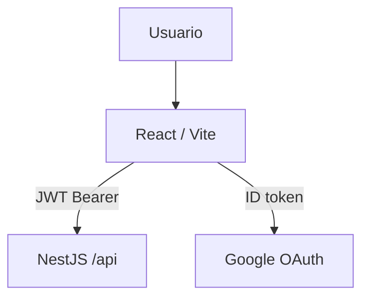

# Arquitectura (Frontend)

> Rutas, features y cómo la SPA consume el API.

[← Anterior](./README.md) · [Índice](./README.md) · [Siguiente →](./02-entorno-local.md)

## Contexto



Profundización del API, BD y MC1 CLI: [Backend — arquitectura](https://github.com/DesarrolloFabrica/Organigrama_Backend/blob/main/documentacion/01-arquitectura.md).

## Capas en este repo

| Capa | Rol |
|------|-----|
| Rutas (`App.tsx`) | Login, onboarding, `/org/*`, lab MC1 |
| Features | `org-chart`, `competencies`, `competency-explorer` |
| React Query | Caché por query key (`org-root`, `org-person-detail`, …) |
| Servicios | `orgChartService`, `competenciesApi`, people-search |

## Flujo de producto

```text
Login → RequireAuth → OrgChartLayout
  → mapa lazy (root / children / node)
  → PersonDetailPanel (ficha / competencias / presentación)
  → competency-explorer (opcional)
```

## Qué no vive aquí

- Guards Nest, migraciones SQL, sync Drive, pipeline MC1 CLI.
- Secretos de producción (`AUTH_JWT_SECRET`, ticket de video, OAuth Drive).

## Código de entrada

- `src/App.tsx`
- `src/features/org-chart/`
- `src/features/competency-explorer/`
- `src/features/competencies/`

[← Anterior](./README.md) · [Índice](./README.md) · [Siguiente →](./02-entorno-local.md)
