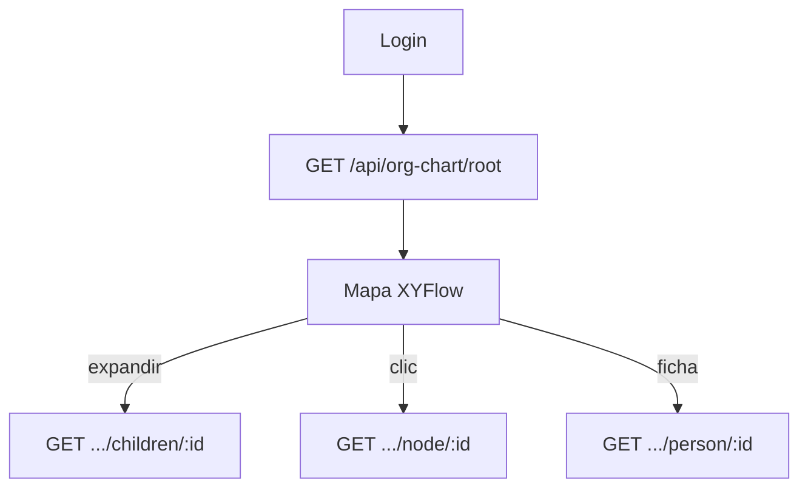

# Organigrama (Frontend)

> Mapa XYFlow, lazy loading, búsqueda y navegación.

[← Anterior](./03-autenticacion-y-visibilidad.md) · [Índice](./README.md) · [Siguiente →](./05-perfiles-cv-y-video.md)

API y motor de árbol: [Backend — organigrama API](https://github.com/DesarrolloFabrica/Organigrama_Backend/blob/main/documentacion/05-organigrama-api.md).

## Rutas

| Ruta | Página |
|------|--------|
| `/org` | Mapa global |
| `/org/team/:personId` | Vista centrada en un líder |
| `/org/competency-explorer` | Buscador ([07](./07-buscador-competencias.md)) |
| `/org-chart` | Redirect a `/org` |
| `/org-chart/team/:personId` | Compatibilidad / team list |

Layout: `OrgChartLayout` (health, versión, header). Feature: `src/features/org-chart/`.

## Carga lazy

**No** uses los endpoints legacy del árbol completo (`GET /api/org-chart`, `/team/:id`) — en prod responden **410**.

## React Query

Keys típicas: `org-root`, `org-node`, `org-children`, `org-person-detail`, búsqueda, video, etc. Invalidar al cambiar versión del organigrama.

## Búsqueda y expansión

- Búsqueda en UI → `GET /api/org-chart/search?q=`.
- Expandir nodo → children; centrar en líder → `/org/team/:personId`.
- Vacantes: nodos sin ficha de competencias/presentación.

## Versiones (UI)

Selector visible si el correo del usuario está en `VITE_ORG_CHART_VERSION_ADMIN_EMAILS`. Snapshot/compare van al API con JWT + allowlist Backend.

## Estados visuales

Loading skeletons al pedir root/children; error de red con reintento; nodos redactados sin PII extendida si el viewer no tiene permiso de ficha completa.

Código: `src/features/org-chart/`, `src/features/org-chart/services/orgChartService.ts`.

[← Anterior](./03-autenticacion-y-visibilidad.md) · [Índice](./README.md) · [Siguiente →](./05-perfiles-cv-y-video.md)
